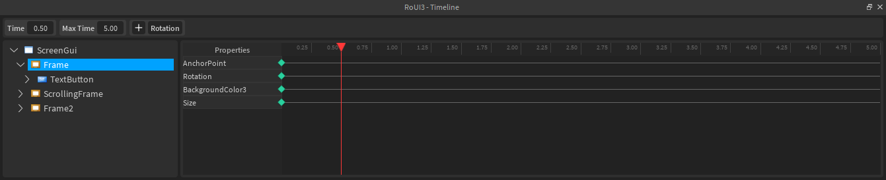

# RoUI3 (In Development)

Create beautiful animations for your Roblox GUIs with RoUI3, a user-friendly and feature-rich Roblox Studio plugin.

The successor to RoUI2, this plugin is foundationally the same yet contains a surplus of new features, a reworked codebase, and a completely overhauled look.

## Timeline Overview

RoUI3's primary plugin widget is known as the Timeline. The Timeline allows you to animate your GUIs quickly and exactly the way you want.

## Installation

A stable release of RoUI3 is not currently available as it is still in development. However, you may compile RoUI3 yourself using [roblox-ts](https://roblox-ts.com/) for an experimental build.

<!-- You can install the latest stable release of RoUI3 directly from the Roblox marketplace [here](#). Alternatively, you can compile the source yourself using [roblox-ts](https://roblox-ts.com/) for the most recent and experimental version. -->
