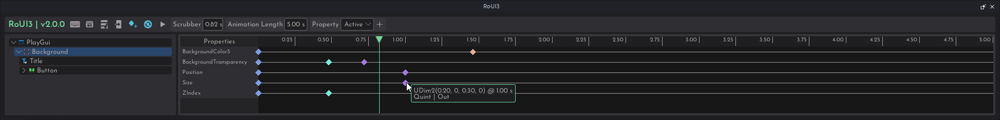

# RoUI3

Create beautiful animations for your Roblox GUIs with RoUI3, a user-friendly and feature-rich Roblox Studio plugin.

## Timeline Overview
RoUI3's primary plugin widget is known as the Timeline. The Timeline allows you to animate your GUIs with precision and speed while still maintaining quality.

## Installation

You can purchase the latest stable release of RoUI3 directly from the Roblox marketplace [here](https://www.roblox.com/library/11798243393/RoUI3). Purchasing it from the marketplace is recommended as it's cheap, will automatically update, and helps support me.

## Using the RoUI3 Animation Module

To learn more about how to use the module to play your animations check out documentation.