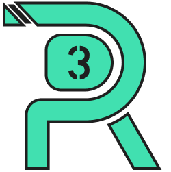

# RoUI3 - v2.0.0

v2.0.0 of RoUI3 is currently undergoing development. This version is a full rewrite from the ground up of the plugin aiming to accomplish the following goals:

1. Cleaner & more readable codebase
2. Completely bug-free
3. Additional features not present in v1.0.0
4. Optimized performance & usability
5. Prettier UI & animations
6. More hotkeys!